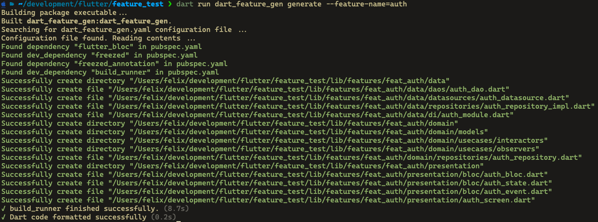

# dart_feature_gen

---

## Overview

`dart_feature_gen` is a powerful feature structure generator following best-practices from clean-architecture principals approaches. It is capable of generating code-blocks using different strategies defined by the user.

## Generation configuration

The primary usage of this package is provided via an CLI. This means, you can execute a `dart run ...` command which generates folder structures & file contents for you. Customization
can be archived by passing additional CLI-Arguments to the command or providing a seaparate dart_feature_gen.yaml file.
Configuration options may contain the output-directory relative to the pubspec.yaml file or data class types to use inside your feature.

An example usage of a command might look like this where the first line is the command written by you:

